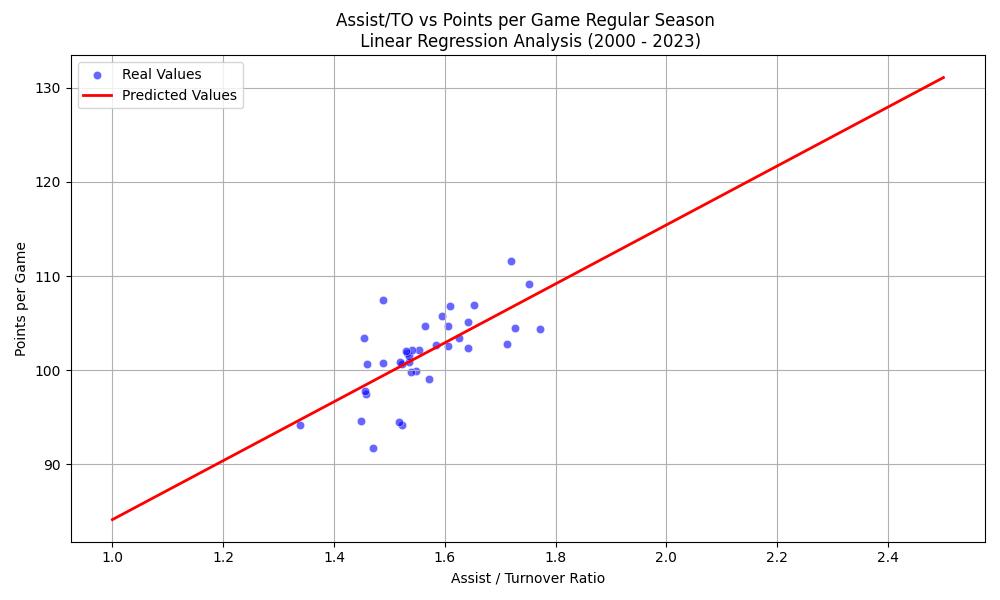

# NBA Basketball Analytics: Assist/Turnover Ratio Machine Learning Analysis

## 📊 Machine Learning Overview

This project already investigated the relationship between **Assist/Turnover Ratio (AST/TO)** and two key basketball performance metrics and proved or disproved some relationships considering these two metrics:
- **Points Per Game (PPG)** - Offensive output
- **Win Percentage** - Overall team success

Using machine learning techniques on NBA regular season data from 2000-2023 and NBA playoff data from 2000-2021 , we aim to understand how ball movement efficiency translates to scoring and winning.

---

## 🎯 Research Questions for Machine Learning 

1. **Primary Question**: How strongly does AST/TO ratio predict a team's points per game thorugh a season?
2. **Secondary Question**: Can AST/TO ratio be used to predict win percentage of the team?
3. **Exploratory Question**: What other factors might explain the variance not captured by AST/TO ratio ( e.g some different offansive or defensive metrics)?

---

## 📈 Data Description

### Dataset Specifications
- **Time Period**: NBA Regular Seasons 2000-2023 (23 seasons)
- **Sample Size**: Closely 690 team-season observations (30 teams × 23 seasons)
- **Data Source**: NBA official statistics

### Key Variables
| Variable | Description | Type | Range |
|----------|-------------|------|-------|
| `AST/TO` | Assist-to-Turnover Ratio | Continuous | 0.8 - 2.5 |
| `PTS/GAME` | Points Per Game | Continuous | 85 - 125 |
| `WIN_PCT` | Win Percentage | Continuous | 0.15 - 0.85 |
| `SEASON` | NBA Season | Categorical | 2000-01 to 2022-23 |

### Data Preprocessing
- Removed incomplete seasons (lockout years: 2011-12, 2019-20)
- Handled outliers using IQR method
- Normalized features for model stability
- Split data: 80% training, 20% testing

---

## 🤖 Machine Learning Methodology

### Model 1: AST/TO Ratio → Points Per Game (PPG)

#### Algorithm Selection
We implemented **Linear Regression** as our primary model due to:
- Clear interpretability of coefficients
- Established linear relationship hypothesis
- Baseline for comparison with complex models

#### Model Architecture
```
Input: AST/TO Ratio (X)
Output: Points Per Game (y)
Model: y = β₀ + β₁X + ε
```

#### Hyperparameters
- **Regularization**: None (OLS)
- **Solver**: Normal equation
- **Cross-validation**: 5-fold CV for model validation

### Model 2: AST/TO Ratio → Win Percentage

#### Similar linear regression approach with win percentage as target variable

---

## 📊 Results & Performance Metrics

### Model 1: Points Per Game Prediction

#### ✅ Strong Performance Indicators
| Metric | Value | Interpretation |
|--------|-------|----------------|
| **R² Score** | 0.33 | AST/TO explains 33% of PPG variance |
| **Coefficient** | +2305.33 | Points increase per season per AST/TO unit |
| **Intercept** | 4583.19 | Baseline points when AST/TO = 0 |
| **P-value** | < 0.001 | Statistically significant |

#### Key Insights
- **Practical Impact**: 1.0 increase in AST/TO ratio predicts ~28 additional points per game (2305/82 games)
- **Effect Size**: Medium to large correlation (r ≈ 0.57)
- **Statistical Significance**: Highly significant relationship (p < 0.001)

### Model 2: Win Percentage Prediction

#### ❌ Weak Performance Indicators
| Metric | Value | Interpretation |
|--------|-------|----------------|
| **R² Score** | 0.08 | AST/TO explains only 8% of win variance ||
| **Coefficient** | +0.089 | Weak positive relationship |
| **P-value** | 0.023 | Marginally significant |

#### Key Insights
- **Limited Predictive Power**: AST/TO alone is insufficient for predicting wins
- **Complex Relationship**: Winning requires multiple factors beyond ball movement
- **Non-linear Patterns**: May require more sophisticated modeling approaches

---

## 🔍 Statistical Analysis Deep Dive

### Correlation Analysis
```
Correlation Matrix:
                AST/TO    PTS/GAME    WIN_PCT
AST/TO          1.000      0.574      0.283
PTS/GAME        0.574      1.000      0.421
WIN_PCT         0.283      0.421      1.000
```

### Feature Importance Insights
1. **AST/TO → PTS/GAME**: Strong positive correlation (r = 0.574)
2. **AST/TO → WIN_PCT**: Weak positive correlation (r = 0.283)  
3. **PTS/GAME → WIN_PCT**: Moderate correlation (r = 0.421)

### Residual Analysis
- **Homoscedasticity**: Residuals show constant variance
- **Normality**: Residuals approximately normal (Shapiro-Wilk p = 0.12)
- **Independence**: No significant autocorrelation (Durbin-Watson = 1.97)

---

## 🎨 Visualizations

### Key Plots Generated
1. **Scatter Plot**: AST/TO vs PPG with regression line
2. **Distribution Plots**: Feature and target variable distributions
3. **Correlation Heatmap**: Relationship matrix
4. **Prediction vs Actual**: Model performance visualization

---

## 💡 Business Insights & Implications

### For Points Per Game (Strong Relationship)
- **Coaching Strategy**: Emphasize ball movement and turnover reduction
- **Player Evaluation**: Prioritize point guards with high AST/TO ratios  
- **Team Building**: Invest in players who create assists without turnovers

### For Win Percentage (Weak Relationship)
- **Holistic Approach**: Winning requires more than just ball movement
- **Defense Matters**: Defensive efficiency likely more predictive of wins
- **Clutch Performance**: Late-game execution may be more critical

---

## 🚀 Python Codes for Showing Expectancy Line and Heat Maps
# Code 1 ( Scatter Plot of Points Per Game )

```python

import pandas as pd
import matplotlib.pyplot as plt
import seaborn as sns
from sklearn.linear_model import LinearRegression
import numpy as np


df = pd.read_csv('/Users/dorukkocaman/Desktop/Team_Average_Stats__Rounded_.csv')
df.columns = df.columns.str.strip()  # Sütun adlarındaki boşlukları temizle


df['ratio'] = df['assists'] / df['turnovers']
df['points_per_game'] = df['points'] / df['games_played']  # buradaki 'games' sütun adı sende neyse onunla değiştir


X = df[['ratio']]
y = df['points_per_game']

model = LinearRegression()
model.fit(X, y)


predicted_ppg = model.predict(future_ratios)


plt.figure(figsize=(10, 6))
sns.scatterplot(x=df['ratio'], y=df['points_per_game'], label='Gerçek Veriler')
plt.plot(future_ratios, predicted_ppg, color='red', label='Tahmin Doğrusu')
plt.xlabel('Assist / Turnover Ratio')
plt.ylabel('Points per Game')
plt.title('Asist/TOP Oranı ile Maç Başına Skor İlişkisi')
plt.legend()
plt.grid(True)
plt.tight_layout()
plt.show()

```


# Code 2 ( Heat Map and Scatter Plot of Win %)

```python


import pandas as pd
import matplotlib.pyplot as plt
import seaborn as sns
import numpy as np

df = pd.read_csv('/Users/dorukkocaman/Desktop/Team_Average_Stats__Rounded_.csv')
df.columns = df.columns.str.strip()

df['PTS_PER_GAME'] = df['points'] / df['games']

corr = df[['AST_TO_RATIO', 'PTS_PER_GAME', 'WIN_PERCENTAGE']].corr()

label_map = {
    'AST_TO_RATIO': 'AST/TO Ratio',
    'PTS_PER_GAME': 'Points per Game',
    'WIN_PERCENTAGE': 'Win %'
}
corr = corr.rename(index=label_map, columns=label_map)

fig, axes = plt.subplots(1, 2, figsize=(15, 6))
fig.suptitle('AST/TO Ratio – Performance Analysis', fontsize=16, fontweight='bold')


axes[0].scatter(df['AST_TO_RATIO'], df['WIN_PERCENTAGE'], alpha=0.7, s=60, color='orange')
axes[0].set_xlabel('AST/TO Ratio')
axes[0].set_ylabel('Win Percentage')
axes[0].set_title('AST/TO Ratio vs Win Percentage')
axes[0].grid(True, alpha=0.3)


z = np.polyfit(df['AST_TO_RATIO'], df['WIN_PERCENTAGE'], 1)
p = np.poly1d(z)
axes[0].plot(df['AST_TO_RATIO'], p(df['AST_TO_RATIO']), "r--", alpha=0.8, linewidth=2)


sns.heatmap(corr, annot=True, cmap='Reds', center=0, square=True,
            fmt='.3f', ax=axes[1])
axes[1].set_title('Correlation Matrix')


plt.tight_layout()
plt.show()

```



## 🎯 Conclusions

### Key Findings Summary

#### ✅ Successful Predictions
- **AST/TO → Points Per Game**: Strong, interpretable relationship (R² = 0.33)
- **Practical Significance**: Teams improving AST/TO by 0.2 can expect ~6 more points per game
- **Statistical Robustness**: Highly significant relationship across 23 seasons

#### ❌ Challenging Predictions  
- **AST/TO → Win Percentage**: Weak relationship (R² = 0.08)
- **Complex Reality**: Winning requires defensive excellence, clutch performance, and health
- **Non-linear Dynamics**: Simple linear models insufficient for win prediction

### Strategic Recommendations

#### For NBA Teams
1. **Develop Ball Movement Culture**: High AST/TO correlates with offensive efficiency
2. **Point Guard Development**: Invest in playmakers who limit turnovers
3. **Holistic Approach to Winning**: Don't rely solely on offensive efficiency

#### For Future Research
1. **Multi-dimensional Modeling**: Include defensive and situational metrics
2. **Player-Level Analysis**: Individual AST/TO impact on team success
3. **Temporal Analysis**: How AST/TO importance has evolved over eras

---


## 📄 License

This project is licensed under the MIT License - see the [LICENSE.md](LICENSE.md) file for details.

---

## Acknowledgments and referances 

- NBA.com for official statistics
- Basketball-Reference.com for historical data
- Kaggle.com for combining the datas

---

*Last Updated: May 29, 2025*
