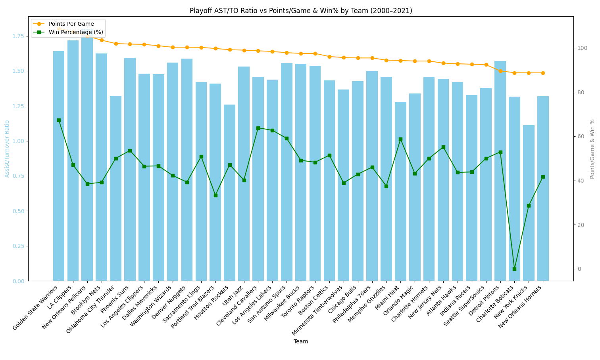

# NBA Assist/Turnover Ratio Analysis Visualization

## Starting Point

I have used two datas named "nba_team_stats_00_to_23.csv" and "games.cs" to achieve the visualization process.
After calculating the main statistics, I decided to create a visual representation to better understand the relationships between metrics.  
Here is the code I used to visualize the data:

```python
import pandas as pd
import matplotlib.pyplot as plt


data = pd.read_csv('/Users/dorukkocaman/Desktop/archive/nba_team_stats_00_to_23.csv')


team_stats = data.groupby('Team').agg({
    'assists': 'sum',
    'turnovers': 'sum',
    'points': 'sum',
    'wins': 'sum',
    'games_played': 'sum'
}).reset_index()


team_stats['AST_TO_RATIO'] = team_stats['assists'] / team_stats['turnovers']
team_stats['PTS_PER_GAME'] = team_stats['points'] / team_stats['games_played']
team_stats['WIN_PERCENTAGE'] = team_stats['wins'] / team_stats['games_played']


team_stats = team_stats.sort_values(by='PTS_PER_GAME', ascending=False)


fig, ax1 = plt.subplots(figsize=(16, 8))


ax1.bar(team_stats['Team'], team_stats['AST_TO_RATIO'], color='skyblue', label='Assist/Turnover Ratio')
ax1.set_xlabel('Team')
ax1.set_ylabel('Assist/Turnover Ratio', color='skyblue')
ax1.tick_params(axis='y', labelcolor='skyblue')
ax1.set_xticks(range(len(team_stats)))
ax1.set_xticklabels(team_stats['Team'], rotation=45, ha='right')


ax2 = ax1.twinx()
line1 = ax2.plot(team_stats['Team'], team_stats['PTS_PER_GAME'], color='orange', marker='o', label='Points Per Game')
line2 = ax2.plot(team_stats['Team'], team_stats['WIN_PERCENTAGE'] * 100, color='green', marker='s', label='Win Percentage (%)')
ax2.set_ylabel('Points/Game & Win %', color='gray')
ax2.tick_params(axis='y', labelcolor='gray')


plt.title('AST/TO Ratio vs Points/Game & Win% by Team (2000-2023)')
fig.tight_layout()
lines = line1 + line2
labels = [l.get_label() for l in lines]
ax2.legend(lines, labels, loc='upper left')


plt.show()


```


*Figure: Visualization of regular season AST/TO ratio compared to Points and Win Percentage*


## 🔍 Playoff Analysis Extension

After calculating the regular season statistics, I also analyzed the playoff statistics,  
as I thought they could provide additional insight for my research.

There are different types of data so I created a new code set to create best visiual


```python
import pandas as pd
import matplotlib.pyplot as plt


data = pd.read_csv('/Users/dorukkocaman/Desktop/archive/nba_team_stats_playoffs_00_to_21.csv')

team_stats = data.groupby('team').agg({
    'assists': 'sum',
    'turnovers': 'sum',
    'wins': 'sum',
    'games_played': 'sum',
    'points': 'mean'  # DİKKAT! points zaten maç başına ortalama, o yüzden mean
}).reset_index()


team_stats['AST_TO_RATIO'] = team_stats['assists'] / team_stats['turnovers']
team_stats['PTS_PER_GAME'] = team_stats['points']  # zaten ortalama olduğu için tekrar bölme yok
team_stats['WIN_PERCENTAGE'] = team_stats['wins'] / team_stats['games_played']


team_stats = team_stats.sort_values(by='PTS_PER_GAME', ascending=False)


fig, ax1 = plt.subplots(figsize=(16, 8))


ax1.bar(team_stats['team'], team_stats['AST_TO_RATIO'], color='skyblue', label='Assist/Turnover Ratio')
ax1.set_xlabel('Team')
ax1.set_ylabel('Assist/Turnover Ratio', color='skyblue')
ax1.tick_params(axis='y', labelcolor='skyblue')
ax1.set_xticks(range(len(team_stats)))
ax1.set_xticklabels(team_stats['team'], rotation=45, ha='right')


ax2 = ax1.twinx()
line1 = ax2.plot(team_stats['team'], team_stats['PTS_PER_GAME'], color='orange', marker='o', label='Points Per Game')
line2 = ax2.plot(team_stats['team'], team_stats['WIN_PERCENTAGE'] * 100, color='green', marker='s', label='Win Percentage (%)')
ax2.set_ylabel('Points/Game & Win %', color='gray')
ax2.tick_params(axis='y', labelcolor='gray')


plt.title('Playoff AST/TO Ratio vs Points/Game & Win% by Team (2000–2021)')
fig.tight_layout()
lines = line1 + line2
labels = [l.get_label() for l in lines]
ax2.legend(lines, labels, loc='upper left')


plt.savefig('image2.png')


plt.show()


```



*Figure: Visualization of playoff AST/TO ratio compared to Points and Win Percentage*


## 📉 Observing Trends vs. Proving Correlation

While analyzing the regular season and playoff data, visualizing Assist/Turnover Ratio, Points Per Game, and Win Percentage, I noticed that although there are **visible trends** in certain areas of the chart, we **cannot confidently claim a clear correlation** between these metrics.

For example, some teams with a relatively high AST/TO ratio also scored well or won more games, but this was not consistent across all teams. In several cases, teams with low assist efficiency still had high win percentages or points per game, and vice versa.

This inconsistency suggests that other factors are likely influencing overall performance in the playoffs. Elements such as **defensive metrics, rebounding, steals, blocks, and defensive ratings** can significantly affect win outcomes and scoring — sometimes overshadowing assist-based efficiency.


---

> This section aims to reflect the complexity of playoff basketball and why single-metric evaluations can be misleading without context.


---

