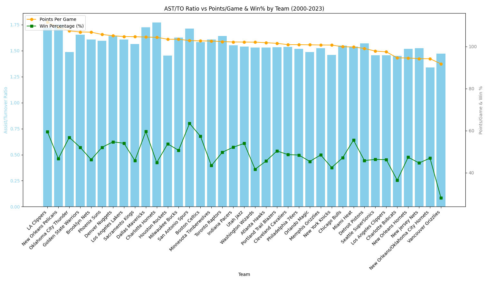

# NBA Assist/Turnover Ratio Analysis Visualization

## Starting Point

I have used two datas named "nba_team_stats_00_to_23.csv" and "games.cs" to achieve the visualization process.
After calculating the main statistics, I decided to create a visual representation to better understand the relationships between metrics.  
Here is the code I used to visualize the data:

```python
import pandas as pd
import matplotlib.pyplot as plt

# Load the dataset
data = pd.read_csv('/Users/dorukkocaman/Desktop/archive/nba_team_stats_00_to_23.csv')

# Group by Team and aggregate totals
team_stats = data.groupby('Team').agg({
    'assists': 'sum',
    'turnovers': 'sum',
    'points': 'sum',
    'wins': 'sum',
    'games_played': 'sum'
}).reset_index()

# Calculate key metrics
team_stats['AST_TO_RATIO'] = team_stats['assists'] / team_stats['turnovers']
team_stats['PTS_PER_GAME'] = team_stats['points'] / team_stats['games_played']
team_stats['WIN_PERCENTAGE'] = team_stats['wins'] / team_stats['games_played']

# Sort teams by Points Per Game
team_stats = team_stats.sort_values(by='PTS_PER_GAME', ascending=False)

# Create the plot
fig, ax1 = plt.subplots(figsize=(16, 8))

# Bar plot: Assist/Turnover Ratio
ax1.bar(team_stats['Team'], team_stats['AST_TO_RATIO'], color='skyblue', label='Assist/Turnover Ratio')
ax1.set_xlabel('Team')
ax1.set_ylabel('Assist/Turnover Ratio', color='skyblue')
ax1.tick_params(axis='y', labelcolor='skyblue')
ax1.set_xticks(range(len(team_stats)))
ax1.set_xticklabels(team_stats['Team'], rotation=45, ha='right')

# Line plots: Points per Game and Win Percentage
ax2 = ax1.twinx()
line1 = ax2.plot(team_stats['Team'], team_stats['PTS_PER_GAME'], color='orange', marker='o', label='Points Per Game')
line2 = ax2.plot(team_stats['Team'], team_stats['WIN_PERCENTAGE'] * 100, color='green', marker='s', label='Win Percentage (%)')
ax2.set_ylabel('Points/Game & Win %', color='gray')
ax2.tick_params(axis='y', labelcolor='gray')

# Title and Legend
plt.title('AST/TO Ratio vs Points/Game & Win% by Team (2000-2023)')
fig.tight_layout()
lines = line1 + line2
labels = [l.get_label() for l in lines]
ax2.legend(lines, labels, loc='upper left')

# Show the plot

plt.show()


```




## 🔍 Playoff Analysis Extension

After calculating the regular season statistics, I also analyzed the playoff statistics,  
as I thought they could provide additional insight for my research.


*Figure: Visualization of playoff AST/TO ratio compared to Points and Win Percentage*


---

